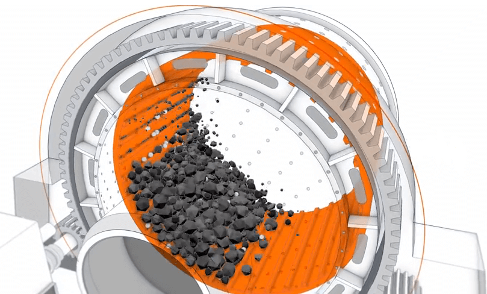

# SAG-mill Project

Semi-autogenous (SAG) mills are central pieces of equipment for large mining
operations.

### Goal

The goal of the project is to devise and implement a prototype data-driven
prediction model of a **Semi-autogenous (SAG) Mill**.

### Overview

**Semi-autogenous (SAG) mills** are central pieces of equipment for large mining operations. They are commonly used in the secondary crushing stage to break down larger rocks from the pit for further processing.

### The exercise

-   Select a model to predict performance variables 5 minutes in advance
-   Implement a prototype of this model to generate results
-   Use the test data to calculate prediction error statistics and compare them to the baseline provided in `baseline.ipynb`

### Solution
**Long-Short-Term Memory (LSTM)** is the next generation of Recurrent Neural Network (RNN) used in deep learning for its optimized architecture to easily capture the pattern in sequential data.

The benefit of this type of network is that it can learn and remember over long sequences and does not rely on pre-specified window lagged observation as input.

### Conclusions
- The error and prediction of the pressure setup using 20 minutes of history inputs confirm the indication given in the *baseline*.

- Model prediction is poor due to an **overfitting issue** that we decide not to solve in this exercise.

- Unfortunately, we haven't been able to extract power data.
